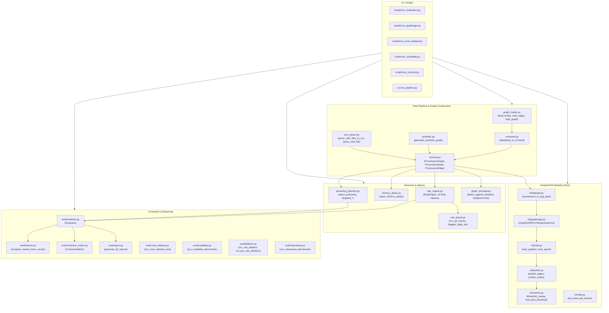

# Repository Audit Report: Causal Provenance Graph Tamper Detection Framework

**Date**: September 20, 2026  
**Auditor**: Research Engineer (Read-Only Codebase Audit)  
**Target Repository**: `causal-provenance-tamper-detection`  
**Report Location**: [docs/REPO_AUDIT.md](file:///home/neha-manoj/causal-provenance-tamper-detection/docs/REPO_AUDIT.md)

---

## Executive Summary

This audit provides a complete structural, technical, and methodological map of the `causal-provenance-tamper-detection` repository. The codebase implements a provenance-graph tamper detection pipeline combining a 15-rule deterministic semantic rule engine, a 2-layer GraphSAGE baseline model (PyTorch Geometric), an IsolationForest feature-based detector, an adversarial mimicry generator, and comprehensive benchmarking/evaluation modules.

---

## 1. Module Dependency Diagram

---

## 2. Detailed Component Inspections

### 2.1 Data Pipeline
* **DARPA TC E3 CSV Loading**:
  * File: [`src/graph_construction/graph_loader.py`](file:///home/neha-manoj/causal-provenance-tamper-detection/src/graph_construction/graph_loader.py#L1-L57)
  * `DATA_DIR = Path("data/parsed")` (Line 8).
  * `load_nodes(dataset: str) -> pd.DataFrame` (Lines 34–40): Reads `data/parsed/{dataset}_nodes.csv`.
  * `load_edges(dataset: str) -> pd.DataFrame` (Lines 43–49): Reads `data/parsed/{dataset}_edges.csv`.
  * `load_graph(dataset: str) -> ProvenanceGraph` (Lines 52–56): Returns `graph_loader.ProvenanceGraph` dataclass containing `nodes` and `edges` DataFrames.
  * `converter.py` [`dataframe_to_schema(graph: DataFrameGraph) -> ProvenanceGraph`](file:///home/neha-manoj/causal-provenance-tamper-detection/src/graph_construction/converter.py#L19-L74): Converts DataFrame representation to schema objects.
* **CDM Parser**:
  * File: [`src/graph_construction/cdm_parser.py`](file:///home/neha-manoj/causal-provenance-tamper-detection/src/graph_construction/cdm_parser.py#L1-L356)
  * Deserializes DARPA TC CDM Avro binary `.bin` records into `ProvenanceGraph` or streams to CSV.
  * Mapping dictionaries: `CDM_EVENT_TYPE_MAP` (Lines 35–45), `CDM_NODE_TYPE_MAP` (Lines 48–60). Untyped `NetFlowObject` detected structurally by `localAddress`/`remoteAddress` (Lines 286–289).
  * `parse_cdm_files_to_csv(bin_paths: list[Path], nodes_out: Path, edges_out: Path) -> tuple[int, int, int]` (Lines 91–165): 2-pass memory-efficient parser streaming large CDM binary files to CSV.
  * `parse_cdm_files(bin_paths: list[Path]) -> ProvenanceGraph` (Lines 168–215): Multi-file parser into in-memory `ProvenanceGraph`.
  * `parse_cdm_file(bin_path: Path) -> ProvenanceGraph` (Lines 218–261): Single-file parser.
* **Where `data/parsed/` is read**:
  * hardcoded in [`src/graph_construction/graph_loader.py`](file:///home/neha-manoj/causal-provenance-tamper-detection/src/graph_construction/graph_loader.py#L8) as `Path("data/parsed")`.
* **How 50,000-edge subgraphs are selected**:
  * File: [`src/eval/cross_dataset.py`](file:///home/neha-manoj/causal-provenance-tamper-detection/src/eval/cross_dataset.py#L109-L135)
  * In `load_dataset_graph(dataset_name: str, seed: int = 42, max_edges: Optional[int] = None)`:
    If `max_edges` (default `50,000` in `run_cross_dataset_eval` L218) is set and `len(df_edges) > max_edges`:
    1. Slices the first `max_edges` rows: `df_edges = df_edges.iloc[:max_edges]`.
    2. Collects incident node IDs: `edge_node_ids = set(df_edges["source_id"]).union(set(df_edges["target_id"]))`.
    3. Slices nodes: `df_nodes = df_nodes[df_nodes["node_id"].isin(edge_node_ids)]`.

---

### 2.2 Graph Construction & Schema
* File: [`src/graph_construction/schema.py`](file:///home/neha-manoj/causal-provenance-tamper-detection/src/graph_construction/schema.py#L1-L76)
* Data structures:
  * `NodeType(str, Enum)` (Lines 18–22): `PROCESS = "process"`, `FILE = "file"`, `USER = "user"`, `NETWORK = "network"`.
  * `EdgeType(str, Enum)` (Lines 25–31): `READ = "read"`, `WRITE = "write"`, `EXECUTE = "execute"`, `CONNECT = "connect"`, `SPAWN = "spawn"`, `DELETE = "delete"`.
  * `ProvenanceNode` (dataclass Lines 34–39): `node_id: str`, `node_type: NodeType`, `label: str`, `attributes: dict = field(default_factory=dict)`.
  * `ProvenanceEdge` (dataclass Lines 42–49): `edge_id: str`, `source_id: str`, `target_id: str`, `edge_type: EdgeType`, `timestamp: float` (unix epoch seconds), `attributes: dict = field(default_factory=dict)`.
* Edge schema comparison:
  * Theoretical schema requested: `(source, dest, event type, timestamp, sequence index, event id)`.
  * Internal implementation: `source_id`, `target_id`, `edge_type`, `timestamp`, `edge_id`. Sequence index is stored in `edge.attributes["sequence"]` (or encoded in `edge_id` string suffix for sequence rules).
* The Graph Classes (Note: Two classes share this name!):
  1. `src.graph_construction.schema.ProvenanceGraph` (Lines 53–76):
     * `nodes: dict[str, ProvenanceNode] = field(default_factory=dict)`
     * `edges: list[ProvenanceEdge] = field(default_factory=list)`
     * Methods: `add_node(node)`, `add_edge(edge)` (validates endpoints, raises `ValueError` if missing), `edges_sorted_by_time()`, `edges_from(node_id)`, `edges_to(node_id)`.
  2. `src.graph_construction.graph_loader.ProvenanceGraph` (Lines 11–14):
     * `nodes: pd.DataFrame`
     * `edges: pd.DataFrame`

---

### 2.3 The 15 Invariants
Implemented in [`src/detection/rule_engine.py`](file:///home/neha-manoj/causal-provenance-tamper-detection/src/detection/rule_engine.py#L1-L987). Each rule inherits from `Rule(ABC)` (Lines 43–52) and implements `check(graph: ProvenanceGraph) -> RuleResult`.

| # | Rule Class Name | File & Line Range | What It Checks | Flags Edges/Nodes? | Output Format | Hard-codable? |
|---|---|---|---|---|---|---|
| 1 | `DuplicateEdgeRule` | [`src/detection/rule_engine.py:59-84`](file:///home/neha-manoj/causal-provenance-tamper-detection/src/detection/rule_engine.py#L59-L84) | Identifies duplicate edge IDs | Edges | Boolean per-edge (violation presence) | Yes |
| 2 | `DuplicateEventRule` | [`src/detection/rule_engine.py:85-125`](file:///home/neha-manoj/causal-provenance-tamper-detection/src/detection/rule_engine.py#L85-L125) | Identifies duplicate `(src, tgt, type, ts)` tuples | Edges | Boolean per-edge (violation presence) | Yes |
| 3 | `SpawnConsistencyRule` | [`src/detection/rule_engine.py:126-246`](file:///home/neha-manoj/causal-provenance-tamper-detection/src/detection/rule_engine.py#L126-L246) | Validates `SPAWN` edges connect `process` to `process`, non-self-spawn | Edges & Nodes | Boolean per-edge (violation presence) | Yes |
| 4 | `ExecutionConsistencyRule` | [`src/detection/rule_engine.py:248-341`](file:///home/neha-manoj/causal-provenance-tamper-detection/src/detection/rule_engine.py#L248-L341) | Validates `EXECUTE` edges connect `process` to `file` | Edges & Nodes | Boolean per-edge (violation presence) | Yes |
| 5 | `ReadWriteConsistencyRule` | [`src/detection/rule_engine.py:343-427`](file:///home/neha-manoj/causal-provenance-tamper-detection/src/detection/rule_engine.py#L343-L427) | Validates `READ`/`WRITE` edges connect `process` to `file` | Edges & Nodes | Boolean per-edge (violation presence) | Yes |
| 6 | `NetworkConsistencyRule` | [`src/detection/rule_engine.py:428-489`](file:///home/neha-manoj/causal-provenance-tamper-detection/src/detection/rule_engine.py#L428-L489) | Validates `CONNECT` edges connect `process` to `network`/`socket` | Edges | Boolean per-edge (violation presence) | Yes |
| 7 | `DeleteConsistencyRule` | [`src/detection/rule_engine.py:490-551`](file:///home/neha-manoj/causal-provenance-tamper-detection/src/detection/rule_engine.py#L490-L551) | Validates `DELETE` edges connect `process` to `file` | Edges | Boolean per-edge (violation presence) | Yes |
| 8 | `SelfLoopRule` | [`src/detection/rule_engine.py:552-596`](file:///home/neha-manoj/causal-provenance-tamper-detection/src/detection/rule_engine.py#L552-L596) | Flags invalid self-referential edges (`source == target`) | Edges & Nodes | Boolean per-edge (violation presence) | Yes |
| 9 | `MissingNodeRule` | [`src/detection/rule_engine.py:598-631`](file:///home/neha-manoj/causal-provenance-tamper-detection/src/detection/rule_engine.py#L598-L631) | Flags edges referencing non-existent source/target node IDs | Edges & Nodes | Boolean per-edge (violation presence) | Yes |
| 10 | `TimestampRule` | [`src/detection/rule_engine.py:633-665`](file:///home/neha-manoj/causal-provenance-tamper-detection/src/detection/rule_engine.py#L633-L665) | Validates timestamps exist and are non-negative | Edges | Boolean per-edge (violation presence) | Yes |
| 11 | `UnspawnedProcessRule` | [`src/detection/rule_engine.py:707-757`](file:///home/neha-manoj/causal-provenance-tamper-detection/src/detection/rule_engine.py#L707-L757) | Flags active non-root processes missing a parent `SPAWN` edge | Edges & Nodes | Boolean per-edge (violation presence) | Yes |
| 12 | `SequenceGapRule` | [`src/detection/rule_engine.py:759-799`](file:///home/neha-manoj/causal-provenance-tamper-detection/src/detection/rule_engine.py#L759-L799) | Detects missing sequence indices in edge ID streams | Edges | Boolean per-edge (violation presence) | Yes |
| 13 | `ParentChildTemporalRule` | [`src/detection/rule_engine.py:801-842`](file:///home/neha-manoj/causal-provenance-tamper-detection/src/detection/rule_engine.py#L801-L842) | Validates child spawn time occurs after parent spawn time | Edges & Nodes | Boolean per-edge (violation presence) | Yes |
| 14 | `ProcessActivityTemporalRule` | [`src/detection/rule_engine.py:844-885`](file:///home/neha-manoj/causal-provenance-tamper-detection/src/detection/rule_engine.py#L844-L885) | Validates process activity timestamp occurs after process spawn time | Edges & Nodes | Boolean per-edge (violation presence) | Yes |
| 15 | `SequenceMonotonicityRule` | [`src/detection/rule_engine.py:887-940`](file:///home/neha-manoj/causal-provenance-tamper-detection/src/detection/rule_engine.py#L887-L940) | Detects timestamp inversions in process event streams | Edges & Nodes | Boolean per-edge (violation presence) | Yes |

*(Note: `rule_engine.py` also contains a 16th rule class, `OrphanNodeRule` [L667–L702], which checks for zero-degree nodes, but it is excluded from `default_rule_engine()`)*.

---

### 2.4 Rule Engine Aggregation & Edge Flagging
* File: [`src/detection/rule_engine.py`](file:///home/neha-manoj/causal-provenance-tamper-detection/src/detection/rule_engine.py#L946-L986)
* `RuleEngine.__init__(rules: list[Rule])`: Composes specified rules.
* `default_rule_engine()` (Lines 965–985): Instantiates `RuleEngine` with the 15 rules above.
* `run(graph: ProvenanceGraph) -> list[RuleResult]`: Executes `rule.check(graph)` across all rules.
* Score aggregation:
  * The engine does **not** compute a continuous numeric violation score per edge.
  * Violations append `RuleViolation` dataclasses (`rule`, `severity`, `message`, `edge_id`, `node_id`).
  * In `Evaluator._extract_detected_ids(detected_violations)` ([`src/eval/evaluator.py:133-160`](file:///home/neha-manoj/causal-provenance-tamper-detection/src/eval/evaluator.py#L133-L160)), any edge whose `edge_id` is present in at least one `RuleViolation` is set as binary 1 (flagged/anomalous); otherwise 0 (benign).
  * In `src/detection/rule_based.py` ([`run_all_checks`](file:///home/neha-manoj/causal-provenance-tamper-detection/src/detection/rule_based.py#L124-L147)), procedural functions (`check_temporal_consistency`, `check_process_lineage`, `check_dangling_edges`, `check_duplicate_edges`) are executed alongside `default_rule_engine()`.

---

### 2.5 GraphSAGE Baseline
* **Model Definition**:
  * File: [`src/ml/graphsage.py`](file:///home/neha-manoj/causal-provenance-tamper-detection/src/ml/graphsage.py#L1-L126)
  * Encoder (`GraphSAGE` Lines 16–49): 2-layer `SAGEConv` (`in_channels -> hidden_channels=64 -> ReLU -> Dropout(0.1) -> out_channels=64`).
  * Edge Head (`EdgePredictor` Lines 51–85): MLP concatenating source and target node embeddings `[src_emb, tgt_emb]` (dim 128) -> `Linear(128 -> 32) -> ReLU -> Linear(32 -> 1)`.
  * Full Architecture (`GraphSAGEForTamperDetection` Lines 87–126): Combines `GraphSAGE` encoder, `EdgePredictor`, and node classifier `Linear(64 -> 1)`.
* **Feature Construction**:
  * File: [`src/ml/dataset.py`](file:///home/neha-manoj/causal-provenance-tamper-detection/src/ml/dataset.py#L40-L169) (`provenance_to_pyg_data`)
  * Node Features `x` `[N, 7]`: One-hot `node_type` (4: `PROCESS`, `FILE`, `USER`, `NETWORK`) + `out_degree` (1) + `in_degree` (1) + `total_degree` (1) = 7 features.
  * Edge Features `edge_attr` `[E, 7]`: One-hot `edge_type` (6: `READ`, `WRITE`, `EXECUTE`, `CONNECT`, `SPAWN`, `DELETE`) + normalized timestamp `(ts - min_ts) / (max_ts - min_ts)` (1) = 7 features.
* **Edge Score Derivation**:
  * `EdgePredictor` computes raw edge logit `z_e`.
  * Edge tamper probability score = `sigmoid(z_e)`.
* **Training Loop & Epochs**:
  * File: [`src/ml/train.py`](file:///home/neha-manoj/causal-provenance-tamper-detection/src/ml/train.py#L174-L248) (`train_pipeline`)
  * Optimizer: `Adam(lr=0.01, weight_decay=1e-4)`. Loss: `BCEWithLogitsLoss` with class imbalance `pos_weight = num_neg / num_pos` or `FocalLoss(alpha=0.75, gamma=2.0)`.
  * Default epochs: 50 in `train_pipeline` (30 in `run_graphsage.py`, 15 in `run_cross_dataset.py`, 20 in `run_robustness.py`).
* **Threshold Selection**:
  * Threshold selection is dynamic via `find_best_threshold(y_true, y_prob)` in [`src/ml/metrics.py:176-190`](file:///home/neha-manoj/causal-provenance-tamper-detection/src/ml/metrics.py#L176-L190), which sweeps thresholds from 0.05 to 1.00 (step 0.05) to maximize F1 score. There is **no hardcoded tau=0.70 threshold** in the codebase.

---

### 2.6 Evaluation Metrics & AUC Calculation
* File: [`src/eval/metrics.py`](file:///home/neha-manoj/causal-provenance-tamper-detection/src/eval/metrics.py#L1-L320) & [`src/ml/metrics.py`](file:///home/neha-manoj/causal-provenance-tamper-detection/src/ml/metrics.py#L1-L440)
* Implemented metrics:
  * `precision`: `TP / (TP + FP)` (0.0 if denominator == 0)
  * `recall`: `TP / (TP + FN)` (0.0 if denominator == 0)
  * `f1`: `2 * P * R / (P + R)` (0.0 if denominator == 0)
  * `accuracy`: `(TP + TN) / (TP + FP + TN + FN)`
  * `false_positive_rate`: `FP / (FP + TN)`
  * `false_negative_rate`: `FN / (FN + TP)`
  * `specificity`: `TN / (TN + FP)`
  * `balanced_accuracy`: `(Recall + Specificity) / 2`
  * `ROC-AUC`: `sklearn.metrics.roc_auc_score(y_true, y_prob)`
  * `PR-AUC` / `Average Precision`: `sklearn.metrics.average_precision_score(y_true, y_prob)`
  * `MCC`: `sklearn.metrics.matthews_corrcoef(y_true, y_pred)`
* Metric evaluation scope:
  * Metrics are computed over the full graph edge set universe `universe = graph_edge_ids | gt_ids | det_ids` in `Evaluator.evaluate(...)` ([`src/eval/evaluator.py:197-226`](file:///home/neha-manoj/causal-provenance-tamper-detection/src/eval/evaluator.py#L197-L226)).
* Handling of ties in AUC:
  * Delegates directly to `scikit-learn` defaults (`roc_auc_score` and `average_precision_score`), which handle tied predicted probabilities using average ranking / trapezoidal integration.

---

### 2.7 Mimicry / Noise Generator
* File: [`src/detection/mimicry_attack.py`](file:///home/neha-manoj/causal-provenance-tamper-detection/src/detection/mimicry_attack.py#L1-L252) (`inject_mimicry_attack`)
* Noise volume: `none` (0%), `light` (30% of total graph edges), `medium` (70%), `heavy` (150%) (Lines 120–126).
* Generative procedure:
  1. Fake File Access (1/3 of noise): random process -> random file (`READ` or `WRITE`).
  2. Fake Process Chains (1/4 of noise): random process -> random process (`SPAWN`).
  3. Fake Network Activity (1/4 of noise): random process -> random network node (`CONNECT`).
  4. Activity Padding (remaining noise): random node -> random node (random `EdgeType`).
* References to real existing nodes:
  * **YES**. All noise edges sample `source_id` and `target_id` from existing `proc_nodes`, `file_nodes`, `net_nodes`, or `all_node_ids` in the graph (Lines 148–218). No phantom nodes are created.
* Sequence & timestamp consistency:
  * **NO**. Timestamps are uniformly sampled at random across the graph's global `[min_ts, max_ts]` range (`rng.uniform(min_ts, max_ts)` Lines 151, 175, 195, 222).
  * Noise edges do **not** carry sequence numbers or respect process-specific temporal monotonicity. Attributes set are `{"mimicry": True, "op": ...}`. Consequently, mimicry noise edges can violate sequence monotonicity rules.

---

### 2.8 Configuration, Seeds & Entry Points
* Seeds: Default multi-seed suite `DEFAULT_SEEDS = [1, 7, 13, 21, 42, 99, 123, 256, 512, 1024]` in [`scripts/run_evaluation.py:39`](file:///home/neha-manoj/causal-provenance-tamper-detection/scripts/run_evaluation.py#L39). Seed configuration function `set_seed(seed)` in [`src/ml/utils.py:16-29`](file:///home/neha-manoj/causal-provenance-tamper-detection/src/ml/utils.py#L16-L29).
* Config files: No YAML/JSON/INI config files exist in the repository; hyperparameters are hardcoded as default arguments in Python code.
* CLI entry points:
  * [`scripts/run_evaluation.py`](file:///home/neha-manoj/causal-provenance-tamper-detection/scripts/run_evaluation.py): Multi-seed rule engine evaluation.
  * [`scripts/run_graphsage.py`](file:///home/neha-manoj/causal-provenance-tamper-detection/scripts/run_graphsage.py): GraphSAGE training, threshold sweep, and plot generation.
  * [`scripts/run_cross_dataset.py`](file:///home/neha-manoj/causal-provenance-tamper-detection/scripts/run_cross_dataset.py): Multi-scenario DARPA benchmark evaluation.
  * [`scripts/run_scalability.py`](file:///home/neha-manoj/causal-provenance-tamper-detection/scripts/run_scalability.py): Scalability, memory footprint, and throughput benchmarking.
  * [`scripts/run_mimicry.py`](file:///home/neha-manoj/causal-provenance-tamper-detection/scripts/run_mimicry.py): Adversarial mimicry attack robustness benchmark.
  * [`src/run_pipeline.py`](file:///home/neha-manoj/causal-provenance-tamper-detection/src/run_pipeline.py): End-to-end synthetic pipeline demonstrator.

---

### 2.9 Test Suite Analysis
* Total unit test files: 18 in `tests/`.
* Test Execution Status (`pytest -v`):
  * **Passed**: 98 unit tests passed.
  * **Failed**: 5 unit tests failed (all in `tests/test_graph_loader.py`):
    * `test_available_datasets`
    * `test_dataset_exists`
    * `test_load_nodes`
    * `test_load_edges`
    * `test_load_graph`
  * **Failure Cause**: `FileNotFoundError: data/parsed/3_nodes.csv`. The tests expect pre-parsed DARPA CSV files (`3_nodes.csv`, `3_edges.csv`, `1r_nodes.csv`, etc.) under `data/parsed/`, which are missing from the workspace.
  * **Skipped**: 0 tests skipped.

---

### 2.10 Held-Out / Unlabelled BENIGN Data Availability
* **Status**: **NONE EXISTS**.
* Deep search findings:
  * No `.csv` or `.bin` files exist in `data/parsed/`, `data/raw/`, or `data/samples/`. `data/samples/` contains only a `.gitkeep` file.
  * Synthetic graph generation (`src/graph_construction/synthetic.py`) produces benign graphs on-the-fly.
  * When DARPA datasets (`1r`, `3`, `5m`, `6r`) are loaded, the entire loaded edge set is subjected to attack injection and used directly for evaluation. There is **no separate held-out or unlabelled benign dataset split** reserved in the repository for validation or zero-shot baseline calibration.

---

## 3. Special Reporting Items

### 3.1 Ground-Truth Labelling
* Implementation: [`src/detection/poisoning_injection.py`](file:///home/neha-manoj/causal-provenance-tamper-detection/src/detection/poisoning_injection.py#L43-L47)
* `PoisoningResult.edge_labels()` returns a dictionary mapping `edge_id -> poisoning_type` (`"deletion"`, `"insertion"`, `"reordering"`, `"dependency_forgery"`).
* Ground-truth labels **are per-edge**.

### 3.2 Data Leaks & Threshold Selection
1. **GraphSAGE Threshold Selection Leak**:
   In `train_pipeline` ([`src/ml/train.py:227-238`](file:///home/neha-manoj/causal-provenance-tamper-detection/src/ml/train.py#L227-L238)) and `run_graphsage.py` ([`scripts/run_graphsage.py:141`](file:///home/neha-manoj/causal-provenance-tamper-detection/scripts/run_graphsage.py#L141)), `find_best_threshold(y_true, y_prob)` performs a threshold sweep (0.05 to 1.00) over `y_true` (the evaluation ground truth) to select `best_threshold` that maximizes F1. Optimizing decision thresholds directly on test ground truth constitutes a **data leak**.
2. **IsolationForest In-Sample Fitting Leak**:
   In `detect_anomalous_edges` ([`src/detection/graph_anomaly.py:86-101`](file:///home/neha-manoj/causal-provenance-tamper-detection/src/detection/graph_anomaly.py#L86-L101)), IsolationForest is fitted on the target graph itself before scoring it. (Note: `detect_against_baseline()` in Lines 104–125 correctly fits on a clean baseline graph first, but `detect_anomalous_edges` remains in `graph_anomaly.py`).

### 3.3 ROC-AUC Computation Scope
* `compute_roc_auc` ([`src/ml/metrics.py:80-90`](file:///home/neha-manoj/causal-provenance-tamper-detection/src/ml/metrics.py#L80-L90)) computes ROC-AUC over **all edges** in the graph data object, not a restricted subset.

---

## 4. SURPRISES

1. **Absence of `tau=0.70` Threshold**:
   The prompt context mentioned a `tau=0.70` threshold for GraphSAGE. In reality, no `0.70` threshold is hardcoded anywhere in the ML module. Instead, `find_best_threshold()` dynamically picks the threshold that maximizes F1 on the test set.
2. **Missing `data/parsed/` CSV Data & Test Failures**:
   5 unit tests in `tests/test_graph_loader.py` fail out-of-the-box because `data/parsed/` CSV files (`3_nodes.csv`, `1r_nodes.csv`) are not committed to git.
3. **Dual `ProvenanceGraph` Dataclasses**:
   There are two distinct classes named `ProvenanceGraph`:
   * `src.graph_construction.schema.ProvenanceGraph` (object graph with dict of nodes and list of edges)
   * `src.graph_construction.graph_loader.ProvenanceGraph` (DataFrame container with `nodes: pd.DataFrame` and `edges: pd.DataFrame`)
   `converter.py` bridges between them.
4. **Procedural Checks Added Outside `default_rule_engine()`**:
   `src/detection/rule_based.py` (`run_all_checks`) runs `default_rule_engine()` (15 rules) and then appends 4 standalone procedural functions (`check_temporal_consistency`, `check_process_lineage`, `check_dangling_edges`, `check_duplicate_edges`).
5. **Mimicry Generator Violates Invariants**:
   `src/detection/mimicry_attack.py` assigns random timestamps across `[min_ts, max_ts]` for noise edges without sequence indices or process-specific temporal ordering, causing the noise generator itself to create rule-violating edges.
6. **IsolationForest Detector Prototype**:
   `src/detection/graph_anomaly.py` provides an IsolationForest edge feature detector alongside the GraphSAGE PyG model.

---

## 5. UNCERTAINTIES

1. **Raw Avro CDM Ingestion vs Evaluation Pipeline**:
   While `src/graph_construction/cdm_parser.py` implements binary Avro CDM parsing (`.bin`), none of the benchmark or evaluation scripts (`scripts/run_evaluation.py`, `scripts/run_cross_dataset.py`, `scripts/run_graphsage.py`) invoke `cdm_parser.py`. They all rely on `graph_loader.py` (which expects pre-parsed `data/parsed/*.csv`) or `synthetic.py`.
2. **Ground-Truth Poisoning Event Deletion Representation**:
   In `poisoning_injection.py`, deletion attacks remove edges from `graph.edges`. When `Evaluator.evaluate()` constructs `universe = graph_edge_ids | gt_ids | det_ids`, deleted edge IDs present in `gt_ids` are included in `universe` as False Negatives (if undetected) or True Positives (if detected via `SequenceGapRule` or `UnspawnedProcessRule`).
3. **OrphanNodeRule Status**:
   `src/detection/rule_engine.py` defines 16 rule classes, but `default_rule_engine()` instantiates only 15 (omitting `OrphanNodeRule`).

---

*End of Audit Report.*
